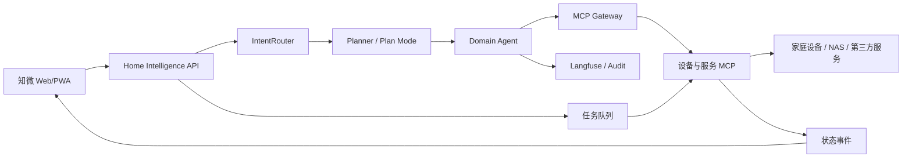

# 知微 Home Intelligence｜产品需求文档

## 1. 一句话定义

知微是部署在家庭局域网中的智能设备控制与编排中枢：它把空间、网络、设备、能力、任务和家庭场景组织成一套可查看、可操作、可推理、可审计的家庭数字孪生。

品牌语：**见微知著，万物留声。**

## 2. 要解决的问题

家庭设备分散在多个品牌应用里，状态、控制方式、账号和自动化彼此割裂。现有平台擅长“点一个开关”，但不擅长回答：

- 家里现在有哪些设备，在哪里，是否在线，由谁连接；
- 某个动作是否真的完成，失败后发生了什么；
- 多个设备如何组成一个可复用、可审阅的家庭场景；
- AI Agent 为什么做出某个计划，调用了什么工具，产生了什么结果；
- 家庭规模从一套平层扩展到多楼层住宅时，模型是否仍然成立。

## 3. 产品目标

1. 用一张按房间组织的首页看清家庭状态，并完成高频设备操作。
2. 所有控制统一进入任务系统；需要过程反馈的操作可追踪、可取消、可重试。
3. 用设备能力模型屏蔽厂商差异，让前端、Agent 和 MCP 使用同一套语义。
4. 让用户通过自然语言或可视化卡片编排家庭场景、工作流和家务流，并在执行前审阅。
5. 保留从需求、架构决策、实现、测试、发布到运行证据的完整追溯链。

## 4. 非目标

- v1 不做 3D 户型或沉浸式数字孪生。
- v1 不替代厂商固件、HomeKit、米家等底层协议；通过适配器和 MCP 接入。
- v1 不允许 Agent 绕过权限、确认、任务队列直接操作设备。
- v1 不承诺所有设备均能远程控制；没有可靠写接口的设备只展示状态。
- v1 不把原始厂商凭证下发到浏览器。
- v1 不把“Skill”当成设备能力模板；设备模板统一称为 **Device Profile**。

## 5. 用户与权限

| 角色 | 能做什么 | 关键限制 |
|---|---|---|
| 管理员 admin | 管理设备、空间、网络、场景、权限和系统配置 | 高风险动作仍需二次确认 |
| 成人 adult | 查看状态、执行获授权的设备操作和场景 | 不能修改安全策略和底层凭证 |
| 儿童 kid | 使用被授权的低风险场景和只读能力 | 强制经过 Compliance；危险设备默认不可见 |

家庭成员是审计主体。每次写操作必须记录 `family_member_id`、`trace_id`、设备、动作、参数、风险等级和结果。

## 6. 设计原则

- **本地优先**：设备控制和状态同步优先在局域网完成；断网时核心能力仍可用。
- **异步优先**：控制请求先成为任务，再由中枢执行；页面不把“请求已发送”伪装成“设备已完成”。
- **状态可信**：运动中的窗帘不显示猜测百分比；结束后以设备上报的真实状态为准。
- **能力驱动**：界面根据设备能力生成控件，不按品牌硬编码页面。
- **先审后做**：复杂任务先生成计划；写操作、外部通知和高风险操作遵循 Draft-First / HITL。
- **渐进披露**：首页只给高频动作，预约、分区、参数和诊断进入详情页。
- **可追溯**：任何需求、架构决策、代码、测试、发布和运行证据都能通过稳定 ID 串起来。

## 7. 信息架构

### 7.1 设备总览

默认是按房间归类的 Widget 卡片流，二级页签切换户型图。

必须支持：

- 查看设备在线状态、关键指标和最近更新时间；
- 在卡片上执行高频操作；
- 离线设备显示浅灰遮罩，控件不可误触；
- 添加设备：选择 Device Profile → 更名 → 配置连接参数 → 归属建筑/楼层/房间 → 验证连接；
- 编辑设备参数和物理空间归属；
- 4 / 8 / 12 列响应式网格，卡片使用 1×1、2×1、2×2、4×2 等有限尺寸；
- 直板手机、折叠外屏、折叠内屏、13 英寸平板和 16 英寸桌面优先适配；
- 长列表采用页面自然滚动，版权信息留在侧边栏，不能截断信息流。

### 7.2 网络拓扑

展示互联网入口、主路由、从路由、交换/无线链路、中枢、NAS 和终端设备关系。

必须支持：

- 设备按在线、离线、退化状态区分；
- 展示 IP、连接方式、上级节点、信号或链路质量和最后心跳；
- 从拓扑节点进入设备详情；
- 支持多建筑、多楼层，但网络层级不与物理空间层级混为一棵树；
- 网络重启等高风险操作使用不同视觉语义并二次确认。

### 7.3 场景与流程

包含两类对象：

- **家庭场景**：用户主动触发、步骤相对固定、可重复执行，例如“观影模式”“离家模式”。
- **工作流/家务流**：可长时间运行、包含条件与工具调用，可能由自然语言即时生成，例如“下载 4K 杜比视界电影”。

编排器按“步骤卡片”工作：

1. 添加 Device 或 Tool；
2. 选择一个或多个目标；
3. 选择 Action 并填写参数；
4. 将可并行的动作放进同一张卡，将有依赖的动作放进下一张卡；
5. 保存后先 Review，再发布；
6. 执行时按卡片逐步推进，显示每一步的等待、运行、成功、失败、跳过和人工确认状态。

自然语言创建流程：意图识别 → 匹配预制 Skill 或进入 Plan Mode → 生成建议步骤卡 → 人工审阅/修改 → 发布 → 执行。

预置场景：

- 观影模式：关闭窗帘 → 调暗客厅灯并关闭餐厅灯 → 打开显示屏 → 打开流媒体盒子和播放器 → 查询家庭媒体库的新电影并推荐 → 客厅音箱播报。
- 离家模式：检查并关闭灯光、空调、新风、显示屏和流媒体盒子；任何失败都单独报告。
- 下载电影：解析片名与画质要求 → NAS 检索 MCP → 过滤候选 → 下载 MCP → 等待完成 → 微信通知。

### 7.4 任务队列

任务队列分为：

- **优先队列**：只接受异步任务，并要求过程状态上报。用于窗帘、卷帘、扫地等用户需要立即知道进度的操作。
- **普通队列**：用于查询、批处理、下载、统计、通知等不要求高频反馈的任务。

统一状态：`queued → accepted → running → succeeded | failed | cancelled | timed_out`。需要人工确认时进入 `waiting_confirmation`，设备离线可进入 `waiting_device`。

每个任务必须有幂等键、超时、重试策略、发起者、风险等级、目标设备、输入快照、结果、错误码和 `trace_id`。优先队列禁止同步直调。

## 8. 设备交互规范

| Device Profile | 首页控件 | 状态与任务规则 |
|---|---|---|
| 空调 | 左减右加，按 1°C 调整；显示目标温度和模式 | 发送目标值，不做连点累加猜测；设备回报后更新 |
| 可调灯 | 右上开关；开启后展开亮度滑条 | 关闭时隐藏滑条；拖动结束再提交，避免请求风暴 |
| 对开窗帘 | 左“打开”、中“暂停”、右“关闭”；显示左右帘百分比 | 打开完成为 0%，关闭完成为 100%；运动中隐藏百分比并显示动画；进入优先队列 |
| 卷帘 | 上“打开”、中“暂停”、下“关闭”；右侧显示百分比 | 与窗帘相同，以真实上报为准；进入优先队列 |
| 鱼缸 | 灯光类型下拉、灯光开关、投食按钮 | 手动或定时投食均显示旋转动画，结束后记录结果 |
| 智能插座 | 开关 + 日/周/月用电量 | 断路由器电源等动作提升风险等级并二次确认 |
| 路由器 | 状态 + 独立样式的“重启”按钮 | 弹出影响说明和确认框；任务可导致短暂失联 |
| 扫地机器人 | “全屋清洁”快捷按钮 | 预约与指定区域清洁只在详情页设置 |
| 音响/升降衣架 | 明显的“按住说话”控件 | 长按录音、松开发送、滑动取消；保留转写文本供确认 |
| 手机/平板/电脑 | 在线/离线、网络、最后心跳 | 不提供电源开关 |
| 家庭智能中枢 | Agent 状态、5 小时/周限额、预充值余额 | 明确数据更新时间和来源；额度不可用时显示“未知”而非 0 |
| 家庭数据中心 | 运行服务数、CPU、内存、磁盘、温度 | 指标按时间窗展示；告警进入普通队列或通知流 |

## 9. 空间、设备与能力模型

核心实体：

```text
Home → Building → Floor → Room → Device → Capability
                              ↘ NetworkNode
DeviceProfile → CapabilitySchema → ActionSchema
Scene/Workflow → StepCard → ActionInvocation → Task → Event
Member → Role/Policy → Permission → AuditEvent
```

约束：

- 物理空间和网络拓扑是两种关系视图，设备通过稳定 `device_id` 关联；
- 能力定义动作、参数、状态 Schema、风险等级和 UI 控件建议；
- Device Profile 可以继承通用能力并覆盖厂商差异；
- Ontology 维护实体类型、关系、受控词汇和版本；Schema 变更必须兼容已有设备或提供迁移；
- 公共演示使用完全虚构的多房间住宅；数据模型必须支持多建筑、多楼层和地下层，不绑定任何真实家庭面积或户型。

## 10. 系统边界



- 前端只访问家庭中枢 API，不持有厂商凭证。
- IntentRouter 负责意图与风险分级；Planner 负责复杂任务图；设备控制通过 MCP Gateway。
- LangGraph/checkpointer 保存长程流程状态；RabbitMQ 只承担异步任务分发，不代替编排状态机。
- PostgreSQL + RLS 保存业务与审计数据；Neo4j 保存家庭 Ontology；Langfuse 记录 Agent 执行链。
- 写操作采用 prepare/confirm/execute；高风险动作不可自动跳过确认。

## 11. 非功能需求

| 领域 | 要求 |
|---|---|
| 可用性 | 局域网内核心状态查看和手动控制不依赖公网；单个适配器故障不拖垮全站 |
| 性能 | 首页首屏状态快照在局域网目标 2 秒内可用；控制任务 300ms 内返回任务 ID |
| 一致性 | 页面区分期望状态与设备确认状态；最终状态以设备事件或重新查询为准 |
| 安全 | 零公网入站端口；OIDC、JWT 透传、工具侧鉴权、RLS、最小权限和凭证隔离 |
| 隐私 | PII 在进入外部 LLM 前检测；音频默认只保留转写和必要审计，可配置留存期 |
| 韧性 | 任务具备幂等、超时、有限重试、死信和人工恢复；重启后可从检查点继续 |
| 可观察性 | 请求、计划、工具调用、任务和设备事件共享 `trace_id`；可查延迟、错误、token 与成本 |
| 可访问性 | 键盘可操作、状态不只靠颜色、触控目标适合手机、动画遵循减少动态效果设置 |
| 兼容性 | 支持直板手机、折叠外屏/内屏、横竖屏、13 英寸平板和 16 英寸桌面 |

## 12. 成功指标

- 设备状态新鲜度：95% 在线设备的首页状态不晚于目标心跳窗口。
- 控制可信度：任务“成功”与设备真实状态一致率 ≥ 99%。
- 高频操作效率：80% 常用动作在首页两次交互内完成。
- 场景成功率：已发布场景完整执行成功率 ≥ 95%，失败步骤可定位。
- 可追溯率：100% 发布变更能回溯到 Story、测试证据、PR、版本和运行追踪。
- 人工可控：100% 高风险动作在执行前有明确确认与影响说明。

指标必须落到可验收 Story，不能只停留在产品口号：

| 指标 | Story | 验收落点 |
|---|---|---|
| 95% 设备状态新鲜度 | `ZW-ST-0301` | 在线设备状态在定义的心跳窗口内更新，并保留 `observed_at` 与 freshness |
| ≥ 99% 控制可信度 | `ZW-ST-0304` | 任务成功与设备真实状态一致，未确认状态不得显示为完成 |
| 80% 高频操作两次交互内完成 | `ZW-ST-0501` | 在首页完成常用动作，不强制进入详情页 |
| ≥ 95% 场景完整执行成功率 | `ZW-ST-1101` | 每个步骤等待设备任务终态，失败、取消和跳过可定位 |
| 100% 发布变更可追溯 | `ZW-ST-1703` | Story、TC、PR、Release 和 trace 形成闭环 |
| 100% 高风险动作先确认 | `ZW-ST-1503` | 所有入口共用 prepare/confirm/execute 策略，确认令牌绑定动作参数 |

## 13. Roadmap 与交付阶段

Roadmap 表示长期产品结果，Epic 表示一个可度量的能力域，Story 是一个可独立验收的用户价值切片。Phase/Release 是时间维度，不与 Feature 混用。

| Release | 目标 | 主要范围 | 出口条件 |
|---|---|---|---|
| P0 定义与契约 | 统一术语、边界和接口 | PRD、Ontology v0、Device Profile、任务/事件契约、威胁模型 | 核心契约评审通过，ADR 与 Story 可追溯 |
| P1 可控设备孪生 | 从演示数据走到真实只读与安全控制 | 状态快照、设备详情、空间归属、首批设备适配器、普通/优先队列 | 至少 5 类真实设备稳定接入，失败可恢复 |
| P2 场景闭环 | 发布并运行可审阅的家庭场景 | 步骤卡编排、观影/离家、HITL、运行结果 | 场景逐步执行、失败定位、重试与审计可用 |
| P3 Agent 工作流 | 用自然语言生成和执行复杂流程 | IntentRouter、Planner、Skill/Tool/MCP、下载电影流程 | 计划可审阅，长任务可断点续跑，成本可观测 |
| P4 治理与规模化 | 支持更多家庭成员、设备和多楼层住宅 | 权限策略、儿童保护、Ontology 演进、多层空间、运维告警 | 多角色权限验证通过，规模与容灾演练达标 |

## 14. Story 准入与完成标准

### Definition of Ready

- 有稳定 Story ID、父 Epic、目标 Release 和负责人角色；
- 描述用户价值，而不是实现动作；
- 范围与非目标明确，依赖和风险已登记；
- 验收标准可验证，接口或 UX 引用可定位；
- 足够小，团队可在一个迭代内完成；否则继续纵向切分。

### Definition of Done

- 验收标准全部通过，自动化测试和必要的真实设备验证有证据；
- 安全、隐私、可访问性和可观察性要求已检查；
- 代码合并，文档、契约、迁移和回滚方案同步；
- Story 关联 PR、测试用例、发布版本和 `trace_id` 样例；
- 关联阻塞缺陷关闭，功能在目标环境可用。

## 15. 需求与交付追溯

每个对象使用不随平台迁移而改变的 ID：

```text
Roadmap ZW-RM-* → Epic ZW-EP-* → Story ZW-ST-* → Task ZW-TK-*
                                             ↘ TC-* / BUG-* / ADR-* / PR / Release / Trace
```

规则：

1. Markdown/Excel 是定义与交换格式，Jira 或 GitHub 是执行视图；同一字段只指定一个权威来源。
2. Story 才是可独立交付的最小需求；Task 只描述实现行动，不单独宣称用户价值。
3. 架构变化先写 ADR；实现 PR 必须引用 Story；测试证据必须引用 Story 和版本。
4. 发布记录列出本次完成的 Story、遗留缺陷、迁移、回滚点和监控链接。
5. 运行问题从 `trace_id` 回溯到任务、设备、发布版本、PR 和 Story。

## 16. 主要风险与待决策

| 项目 | 当前处理 |
|---|---|
| 厂商接口不稳定或无写权限 | 适配器标注能力等级：只读、可控、实验性；不伪造能力 |
| 状态上报延迟造成误导 | 区分期望/确认状态；运动中隐藏不可信百分比 |
| 路由器/插座误操作导致家庭断网 | 提升风险、二次确认、显示影响范围、保留本地恢复路径 |
| AI 计划越权或范围膨胀 | Tool-side AuthZ、预算/步骤上限、Plan Review、HITL 与审计 |
| Ontology 过早复杂化 | v0 只覆盖空间、设备、能力、任务、成员和场景；按真实用例演进 |
| Jira/GitHub 层级差异 | 稳定逻辑 ID + Parent ID；平台映射放在导入视图，不污染产品语义 |

## 17. 关联交付件

- 需求清单与平台导入视图：`知微-需求路线图.xlsx`
- 前端原型：<https://zhiwei-home-intelligence.ruoxu-wang720739.chatgpt.site/>
- 平台架构与 ADR：`D:/Dev/ai-family/docs/`
- Harness 需求、测试与缺陷规范：`D:/Dev/ai-family/harness/`
